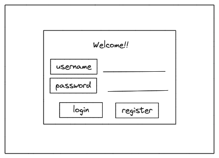
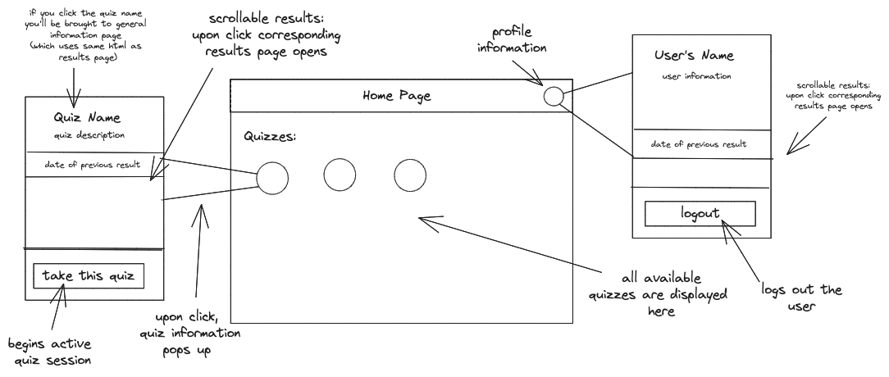
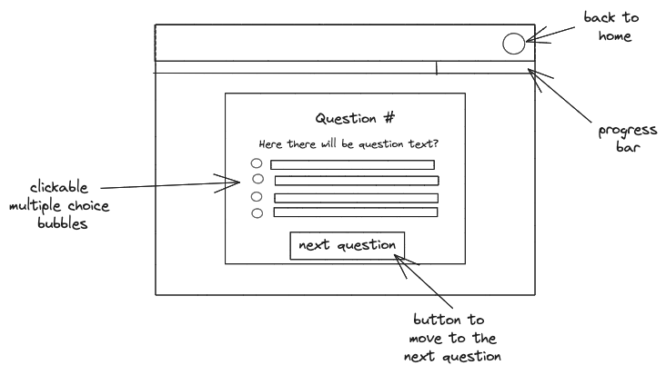
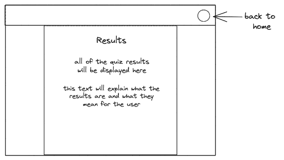

# startup

## Specification
On my application users will be able to learn more about themselves. After creating an account they will be able to take personality quizzes, view their results, and read more about their personality. 

#### Design
##### Login

##### Home Page Layout

##### Active Quiz Page

##### Results Page

#### Key Features
- Secure login
- Ability to select between quizzes
- Clear display of quiz results
- Ability to save and view previous quiz attempts
- Progress bar that indicates user's progress to completion 
- Ability for users to delete old results

#### Technology Usage
**HTML** - Uses correct HTML structure, four HTML pages, one for login/register, one for the user's home page, one for the active quiz environment, and one for quiz results

**JavaScript** - Provides login, progress bar, displaying questions,, backend endpoint calls.

**Service** - Backend service with endpoints for:
- login/register
- retrieving old results
- submitting new results

**Database Data** - Store user information, results, and general data in the database. 

**Authentication** - Users login and register for accounts with secure credentials. All results will be saved and viewable upon logging into the application. 

**WebSocket Data** - Progress bar updates as users complete the quiz

**React** - Application ported to use the React web framework.

